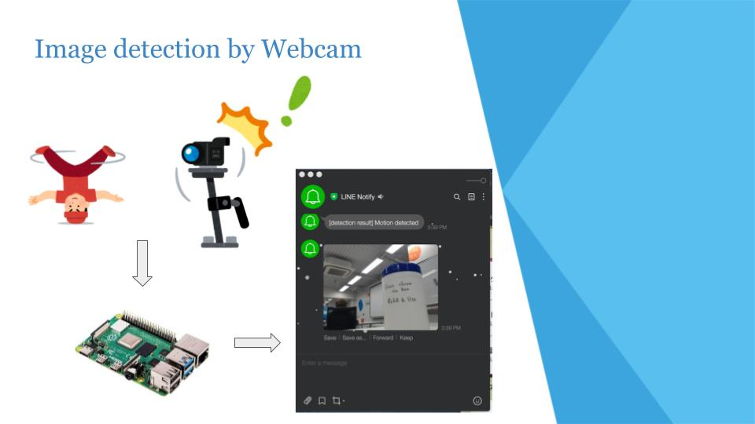

This project was created during my time as a student at Code Chrysalis

## Image detection on Raspberry Pi
 
I created a program that automatically takes a picture when there is a certrain amount of movement in the camera's shooting range, and sends it to own Line and Slack.

## Features
- It detects when there is a certain amount of movement within the camera's area.
- It notifies Slack and Line after detection. However, you need to set up Slack and Line for notification in advance.

## Technology used

## Future features

## License

MIT
